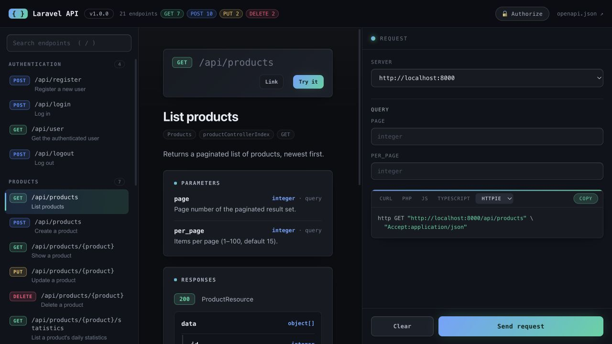

# Documentator

Interactive API documentation for Laravel that mostly writes itself.

Documentator scans your application's routes, FormRequests, API Resources and
controller return types to infer documentation automatically, lets you refine
anything with PHP attributes, and serves an interactive UI — backed by a standard
**OpenAPI 3.1** document — so third parties can browse your endpoints, read
descriptions, and try requests live.

- **Zero-config by default** — point it at `api/*` and you get useful docs.
- **Inference first, overrides last** — FormRequests, inline validation, Data
  objects, Resources, Eloquent models, return statements and PHPDoc do the heavy
  lifting; PHP attributes refine or replace anything.
- **Built-in explorer** — a dark "Aurora" UI with no external assets, route
  sections, filters, a request playground, auth, snippets and a readable
  response viewer. Or switch to [Scalar](https://scalar.com).
- **Standard output** — a plain OpenAPI 3.1 document other tools can consume,
  with response schemas shared by multiple operations hoisted into
  `components/schemas`.

Requires PHP 8.2+ and Laravel 12 or 13.



## Installation

```bash
composer require tsitsishvili/documentator
```

Publish the config (optional):

```bash
php artisan vendor:publish --tag=documentator-config
```

Visit `/docs` to see the interactive UI. The raw spec is at `/docs/openapi.json`.
When `grouping.sections` is configured, each section gets its own UI and split
spec, such as `/docs/api` and `/docs/api/openapi.json`.

## How inference works

For every route matching `config('documentator.routes.match')`, an ordered
pipeline enriches the endpoint:

| Source | Produces |
| --- | --- |
| Route definition | verbs, URI, **typed path params** (numeric constraint / bound-model key → `integer`), name, auth guess from `auth` middleware |
| Controller PHPDoc | **summary** (first line) and **description** (the rest), so written docblocks become docs |
| FormRequest `rules()` | parameters with types, required, **enums** (`in:`, `Rule::enum`, `Rule::in`), **formats** (email/uuid/date), bounds (`min`/`max`), `regex`→`pattern`, `digits`→integer, `confirmed`→a `_confirmation` field, nullability, **nested** rules (`items.*.id`), **file uploads** → multipart. On GET/HEAD routes these become **query parameters** instead of a body |
| Inline `$request->validate([...])` | the same rule parsing for literal inline validation arrays in controller methods |
| spatie/laravel-data | request/response **Data objects** — typed properties, enums, nested Data, collections (optional, auto-detected) |
| Controller return type / return statement | a success response schema from a Resource's `toArray()`, a `ResourceCollection`, a `Resource::collection($q->paginate())` **return statement** (**paginator envelope** + `page`/`per_page` query params), literal `response()->json([...], 202)` payloads, common Laravel response helpers (`response()`, `view()`, redirects), service methods that return arrays, or an **Eloquent model** (`$casts` + `@property`). Status follows the verb: POST → **201**, DELETE → **204** |
| Generated examples | a representative `example` for every body/parameter — format- and name-aware (`email`→`user@example.com`, `*_url`, `*_name`, dates, enums, …) so the playground starts filled |
| PHP attributes | overrides for everything above (runs last) |

```php
/**
 * Create an order.
 *
 * Charges the customer and returns the created order. This summary and
 * description are read straight from the docblock — no attributes needed.
 */
public function store(StoreOrderRequest $request): OrderResource
{
    // Inferred with no attributes: path param {order}, body params from
    // StoreOrderRequest::rules(), a 201 response from OrderResource.
    return new OrderResource(Order::create($request->validated()));
}
```

### With spatie/laravel-data

Install [`spatie/laravel-data`](https://github.com/spatie/laravel-data) and any
Data object you type-hint is documented with no extra annotation — request fields
from the argument, response schema from the return type:

```php
public function store(CreateOrderData $data): OrderData
{
    // body params from CreateOrderData's typed properties; 201 response from OrderData
    return OrderData::from(Order::create($data->toArray()));
}
```

## Overriding with attributes

Attributes always win over inference. Mix and match as needed:

```php
use Tsitsishvili\Documentator\Attributes\{Summary, Description, Group, BodyParam, Response, Authenticated};

#[Group('Orders')]
#[Summary('Create an order')]
#[Description('Creates an order for the authenticated customer.')]
#[Authenticated]
#[BodyParam('coupon', 'string', required: false, description: 'Optional promo code')]
#[Response(201, resource: OrderResource::class, description: 'Order created')]
#[Response(422, description: 'Validation failed')]
public function store(StoreOrderRequest $request): OrderResource
{
    // ...
}
```

Available attributes: `Summary`, `Description`, `Group`, `Authenticated`,
`Hidden`, `Deprecated`, `BodyParam`, `QueryParam`, `PathParam`, `Response`.
`Group`, `Authenticated`, `Hidden` and `Deprecated` may also be placed on the
controller class to set a default for all its methods (`#[Deprecated]` also
honours PHP 8.4's native `#[\Deprecated]`). `#[Response(resource: X, paginated: true)]` (or
`collection: true`) wraps a resource in the paginator / `{ data: [...] }`
envelope; add `paginationLinks: false` for a custom collection that drops
Laravel's `links` blocks.

For versioned APIs, keep the group name stable and put the version on the group:

```php
#[Group('Products', version: 'v2')]
final class ProductController
{
    // ...
}
```

Documentator emits the version as `x-documentator-group-version`, shows it as a
group badge in the built-in UI, and prefixes generated operation IDs with it to
avoid collisions between versions.

Put `#[UsesModel(Order::class)]` on a Resource to tell the extractor which
Eloquent model it wraps (otherwise the model is resolved by naming convention,
configurable via `models_namespace`), so field types come from the model's casts.

## Authentication

Auth schemes are declared in `config('documentator.security')` as OpenAPI
`securitySchemes`. Endpoints behind `auth` middleware are marked authenticated
automatically — and `auth:<guard>` picks the scheme whose key matches the guard
name, falling back to `default`; use `#[Authenticated('scheme-key')]` to be
explicit or pick a non-default scheme. Token-ability middleware
(`abilities:` / `ability:` / `scopes:` / `scope:`) is surfaced as the operation's
required scopes. Custom middleware aliases can be mapped with
`documentator.auth_middleware`, for example `internal.auth` → `internal`.
The UI renders the matching authorize / token input.

To require auth across the whole API instead of marking each endpoint, set
`documentator.authenticate` to `true` (or a scheme name) — it emits a top-level
`security` requirement applied to every operation. Endpoints that aren't
authenticated opt out automatically and stay public.

## Trying requests

The built-in explorer can call your API live. It remembers the auth token and
selected server across endpoints, deep-links each endpoint (`#get-api-orders`)
for sharing and reload — the **Link** button copies that deep link — renders
Markdown in descriptions, and shows a copyable request snippet in **cURL, PHP
(Laravel `Http`), JavaScript (`fetch`), TypeScript, Python (`requests`), Go,
Ruby, Java, C# and HTTPie** — cURL, PHP, JS and TypeScript as tabs with the rest
under an **Other** dropdown, and the chosen language is remembered too. The
TypeScript snippet generates typed `Request` / `Response` interfaces and an
`async` `fetch` wrapper (with `Date` hydration).

The request panel is resizable on desktop and becomes an off-canvas drawer on
smaller screens. Use **Clear** to reset path, query and body inputs without
forgetting the selected server or auth token. JSON responses render as a
collapsible tree with **Expand all** / **Collapse all**, while **Copy** still
copies the full formatted response body. Shortcuts: `/` focuses search,
`Cmd/Ctrl+Enter` sends, `Esc` closes panels.
Cross-origin "try it" calls require the API to allow CORS from the docs origin.

## Organizing larger APIs

For applications with multiple route surfaces, configure sections:

```php
'routes' => [
    'match' => ['api/*', 'app/*'],
],

'grouping' => [
    'sections' => [
        'api' => 'API',
        'app' => 'App',
    ],
],
```

Documentator redirects `/docs` to the first section and serves split specs at
`/docs/api/openapi.json`, `/docs/app/openapi.json`, and so on. Cached generation
also writes section files next to the full cached spec.

Within a section, groups can come from controllers, path segments, or explicit
`#[Group]` attributes:

```php
'grouping' => [
    'source' => 'auto', // auto, controller, path
    'path_depth' => 1,
    'ignore_path_prefixes' => ['api'],
    'ignore_path_parameters' => true,
],
```

Route-wide placeholders such as `{pathlang}` or `{tenant}` can be described once
and reused everywhere:

```php
'global_path_parameters' => [
    'pathlang' => [
        'description' => 'Language code used by localized routes.',
        'schema' => ['type' => 'string', 'enum' => ['ka', 'en']],
        'example' => 'ka',
        'grouping' => false,
    ],
],
```

Those parameters are marked in the OpenAPI document with
`x-documentator-global`, and the metadata is also emitted at
`x-documentator-global-path-parameters`.

## Production

The docs are open everywhere except production by default; in production set
`DOCUMENTATOR_ENABLED=true` (and/or add auth via `route.middleware`) to expose
them. To restrict *who* may view the docs, register an authorization gate from
a service provider's `boot()` — it runs after the route middleware, so the
authenticated user is available:

```php
use Tsitsishvili\Documentator\Documentator;

Documentator::auth(fn ($request) => $request->user()?->is_admin);
```

Returning `false` aborts with a 403. Building the document scans routes per
request, so pre-build it:

```bash
php artisan documentator:generate                  # warm the cache (set DOCUMENTATOR_CACHE=true)
php artisan documentator:export openapi.json        # write the OpenAPI spec for CI / tooling
php artisan documentator:postman collection.json    # export a Postman v2.1 collection
```

### Keeping docs honest in CI

`documentator:check` audits the generated docs — it flags closure routes (which
can't be introspected) and endpoints with no documented success schema, and can
detect drift from a committed spec, listing the specific path / operation /
response changes. It also prints a documentation health summary (operation
count, tags, secured operations, missing/generic summaries and generic success
responses):

```bash
php artisan documentator:check                         # report issues (exit 0)
php artisan documentator:check --strict                # fail the build if any issue is found
php artisan documentator:check --json                  # machine-readable CI/dashboard payload
php artisan documentator:check --suggest-hidden        # suggest internal/debug routes to hide
php artisan documentator:check --against=openapi.json  # fail if the spec has drifted; re-export and commit
```

## Configuration

Key options in `config/documentator.php`:

- `enabled` — docs access; `null` = open except in production, or force `true`/`false`. Restrict *who* may view with `Documentator::auth()`.
- `routes.match` / `routes.exclude` / `routes.exclude_middleware` — which routes are documented.
- `route.prefix` / `route.middleware` / `route.domain` — where the UI is served. Lock it down for private APIs.
- `title` / `version` / `description` / `servers` — OpenAPI `info` and server list.
- `security` — auth schemes.
- `auth_middleware` — middleware aliases/patterns that imply auth schemes.
- `authenticate` — require a scheme API-wide (`true` = the `default` scheme, or a scheme name); `false` = per-endpoint.
- `error_responses` — infer conventional 401/403/404/422 responses from the endpoint shape (default `true`).
- `infer_status_codes` — pick the success status from the verb (POST → 201, DELETE → 204) instead of always 200 (default `true`).
- `generate_examples` — seed an example for every body/parameter that lacks one (default `true`).
- `models_namespace` — where Resources' wrapped models live (for cast-based typing).
- `grouping.*` — controller/path grouping and split section specs such as `/docs/api/openapi.json`.
- `global_path_parameters` — reusable metadata for placeholders shared across many routes.
- `ui.driver` — `documentator` (built-in explorer, default) or `scalar`.
- `ui.auth_storage` — where the explorer keeps auth tokens: `local`, `session`, or `memory`.
- `ui.assets` — Scalar bundle URL when `ui.driver = scalar` (pinned; self-host for SRI/CSP).
- `cache` — pre-generated spec file.
- `extensions.strategies` / `extensions.openapi_transformers` — register custom extraction strategies (resolved from the container, inserted just before attribute overrides) and transformers that receive the generated spec array and may return a modified one. See [CONTRIBUTING.md](CONTRIBUTING.md).

## Development

```bash
composer install
composer test          # Pest + Orchestra Testbench
composer lint          # Laravel Pint
npm run test:browser   # Playwright checks for the built-in UI
```

See [CONTRIBUTING.md](CONTRIBUTING.md) for the architecture tour, how to add an
inference strategy or attribute, and the pull-request checklist.
